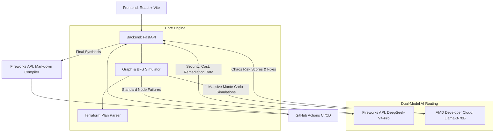

# 🏗️ Preflight AI Architecture

Preflight AI employs a cutting-edge **Dual-Model, Distributed AI Architecture** to handle high-volume chaos simulations in parallel with deep reasoning and synthesis.

## High-Level Diagram

## How It Works

### 1. Terraform Parsing & Graph Generation
When a `.tf` file is uploaded (or analyzed via PR), the backend uses `python-hcl2` and the `terraform plan` command to construct a mathematical Directed Acyclic Graph (DAG) using `NetworkX`. 
This allows the engine to understand the exact topological dependencies of the cloud infrastructure.

### 2. Dual-Model Routing
Because simulating millions of infrastructure failures is incredibly resource-intensive, the backend acts as a smart router:
*   **Targeted Failures (Fireworks):** When analyzing a specific, targeted node failure (e.g., clicking on a single DB in the UI), the system routes the request to Fireworks AI (DeepSeek-V4-Pro). Four concurrent agents analyze Reliability, Security, Cost, and Remediation based on the topological blast radius.
*   **The Chaos Engine (AMD MI300x):** When the "Full Chaos Analysis" is triggered, the engine runs hundreds of Monte Carlo simulations across the entire graph. This massive volume of data is routed to a self-hosted **Llama-3-70B-Instruct** model running on a 192GB VRAM **AMD MI300x** GPU via vLLM. The GPU crunches the chaos metrics and returns the highest risk scenarios and recommended architectural fixes.

### 3. Synthesis & Compilation
When running through GitHub Actions, both streams of data (Standard analysis from Fireworks + Chaos simulation from AMD) are aggregated. This raw JSON payload is fed back into Fireworks AI, acting as the "Editor-in-Chief", which synthesizes the data into a beautifully formatted Markdown code review posted directly to the Pull Request.

### 4. Resiliency & Fallback
If the self-hosted AMD Droplet goes offline or runs out of credits, the backend implements a dynamic runtime fallback. It gracefully catches the network failure and automatically re-routes the Chaos Engine workloads to the Fireworks API, guaranteeing 100% uptime for CI/CD pipelines.
